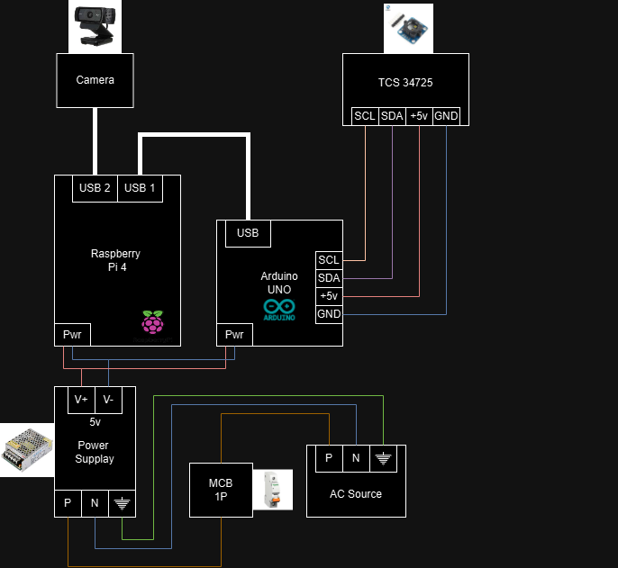

# Bioassay_Color_Mapping

# Pond Water Color Measurement System with TCS34725 & Camera Integration

This project combines a **TCS34725 color sensor** and a **camera** to measure the RGB values of pond water and classify the concentration of plankton (Skeletonema) based on color changes. The system processes data using **KNN classification** and integrates both the camera and sensor readings. The setup includes a **Raspberry Pi** for data collection and a serial connection for communication between Arduino (with TCS34725) and the Raspberry Pi.

## Features

- **Real-time RGB Value Monitoring:** Displays live RGB values from both the TCS34725 color sensor and camera feed.
- **Color Patch Representation:** Visual representation of the RGB values from the sensor and camera in the OpenCV window.
- **Data Logging:** Saves images and RGB data for further analysis.
- **Calibration Support:** Includes a custom calibration feature for sensor accuracy.
- **KNN Classification:** Classifies plankton density based on RGB readings.

## Hardware Requirements

- **TCS34725 Color Sensor**
- **Camera (USB or Pi Camera)**
- **Arduino (any model with a serial port)**
- **Raspberry Pi**
- **LEDs or Stable Indoor Lighting**
- **Waterproof tube (for sensor protection)**

## Software Requirements

- **Python 3.x**
- **OpenCV**
- **NumPy**
- **PySerial (for communication with Arduino)**
- **Arduino IDE** (for TCS34725 sensor code)

## Wiring Instructions



### TCS34725 Color Sensor

| Pin Name | Arduino Pin | Description                                        |
|----------|-------------|----------------------------------------------------|
| VCC      | 5V          | Supplies power to the sensor (5V recommended).     |
| GND      | GND         | Ground connection.                                 |
| SDA      | A4          | Data line for I2C communication (connect to A4).   |
| SCL      | A5          | Clock line for I2C communication (connect to A5).  |

Ensure the sensor is inside a waterproof tube for direct contact with water and that stable lighting is used for accurate measurements.

## Setup Instructions

1. **Clone the repository**:
   ```bash
   git clone https://github.com/yourusername/pond-color-measurement.git
   cd pond-color-measurement
   ```

2. **Install the required Python libraries**:
   ```bash
   pip install -r requirements.txt
   ```

3. **Upload the Arduino code**:
   - Open the `TCS34725.ino` file in the Arduino IDE.
   - Select the appropriate board and port.
   - Upload the code to your Arduino.

4. **Connect the Raspberry Pi**:
   - Connect the Arduino to the Raspberry Pi via USB.
   - Ensure the camera is connected and accessible.
   - Run the main Python script:
     ```bash
     python3 main.py
     ```

5. **Start Data Collection**:
   - The system will display a window with the camera feed, average RGB values from the camera, and color patches representing the sensor and camera readings.
   - Press `s` to save the current frame and RGB data.
   - Press `q` to quit the program.

## Calibration Guide

The system uses the RGB values from the TCS34725 sensor and the camera to compare readings. Follow these steps to calibrate:

1. Place a color sample in the camera's field of view.
2. Run the program and observe the RGB values from both the sensor and the camera.
3. Adjust the calibration code (if necessary) in `sensor_module.py` to fine-tune the sensor readings.

## Usage Guide

- **Real-time Monitoring**: Open the program to visualize and monitor RGB values from both the sensor and camera.
- **Image Capture**: Press `s` to save the current image and RGB data for further analysis.
- **Data Processing**: The saved data can be used to train the KNN model to classify the concentration of plankton based on water color.

## Troubleshooting

- **Camera not detected**: Ensure the camera is properly connected and accessible through `/dev/video0`.
- **Sensor data not appearing**: Check the serial connection between the Arduino and Raspberry Pi. Ensure the correct port is set in the `sensor_module.py` script.

## Future Development

- **Add video streaming functionality** to the web interface.
- **Remote Access**: Enable the system to be accessed remotely over the internet using a VPN or port forwarding.

## License

This project is licensed under the MIT License - see the [LICENSE](LICENSE) file for details.

---

Feel free to modify the content based on the specifics of your project!
